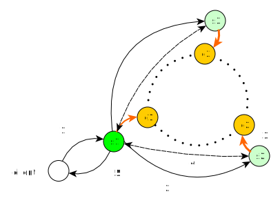

= Instaclustr Icarus

image:https://img.shields.io/maven-central/v/com.instaclustr/icarus.svg?label=Maven%20Central[link=https://search.maven.org/search?q=g:%22com.instaclustr%22%20AND%20a:%22icarus%22]
image:https://circleci.com/gh/instaclustr/icarus.svg?style=svg["Instaclustr",link="https://circleci.com/gh/instaclustr/icarus"]

_Cloud-ready and Kubernetes-enabled Sidecar for Apache Cassandra_

image::Icarus.png[Icarus,width=50%]

- Website: https://www.instaclustr.com/
- OpenAPI Spec: https://instaclustr.github.io/instaclustr-icarus-go-client/
- Documentation: https://www.instaclustr.com/support/documentation/

This repository is home of a sidecar for Apache Cassandra database.
Sidecar is meant to be run alongside of Cassandra instance
and talks to Cassandra via JMX.

Sidecar JAR is also integrating https://github.com/instaclustr/esop[Esop] for backup and restore seamlessly
so it might be used in two modes—either as a long-running server application which responds to clients requests, or as
a CLI application via which one can backup/restore a Cassandra node.

NOTE: Icarus is used in https://github.com/instaclustr/cassandra-operator[Instaclustr Kubernetes operator] as well as in
https://github.com/Orange-OpenSource/casskop[CassKop]—Kubernetes operator for Cassandra from Orange where it is used for backup and restore of clusters.

== Overview

Icarus is a server-like application which acts as a gateway to the Cassandra node it is logically coupled with. In theory,
Icarus process can run wherever, but it needs to talk to a Cassandra node via JMX connection. If you do not want to expose
JMX remotely, Icarus connects to `127.0.0.1:7199` by default. The other prerequisite for backup and restore operations
is that Icarus has to be able to see the same directory structure as Cassandra does as it uploads/downloads SSTables and so on.

If you have a cluster of, let's say, 5 nodes, there should be one Icarus server running alongside each node.

Each Icarus is independent and will execute operations only against the particular node it is configured to interact with.
However, for backups and restores, we need to have a cluster-wide orchestration layer which deals with the complicated
logic of on-the-fly backup and restore for the whole cluster. This mode of operation is called "global". When a backup request
is sent to one of sidecars, whichever Icarus does the job will act as a _coordinator_ of that operation.

The job of a coordinator Icarus is to disperse individual requests to each node in a cluster (and to itself as well), and
continually pull for results and advance the execution once all nodes finish their _phases_. Backup and restore only advances to the other _phase_ when all nodes have finished the current phase
a coordinator orchestrates. After all phases are passed successfully, the coordinator's operation transitions to completed state.

Currently, the coordination/orchestration layer is done only for backup and restore operations as they require
such behavior inherently. All other operations are, as of now, executed only against one particular sidecar and only that
particular Cassandra node it is configured to connect to is affected.

NOTE: For global operation cases, it is important to realize that there is not any main Icarus; all Icaruses are equal in their role—
only if a global request is sent to one particular Icarus during backup or restore will it result in it being promoted to be a coordinator
of a cluster-wide backup and restore operation.

The whole idea of how Icarus works in the case of backup/restore is depicted in the following image:

* `c1`,`c2`,`c3` are Cassandra nodes, forming a ring
* Client is a REST client, submitting operations (1) to Icarus, `s1`. In the image, it acts
as a coordinator of the whole operation
* Coordinator Icarus disperses modified requests (2) to other Icaruses, `s2` and `s3` (it sends a request to itself too)
* each Icarus talks to Cassandra via JMX (3), executing its particular operation
* `s1` knows that other nodes finished a phase because it is continually retrieving these operations and checks its statuses (4)
* After orchestration is done and all phases are finished, client can retrieve its status (5). Icarus does not
try to send anything back to client on its own. We can only query it.

== Build and Release

[source,bash]
----
$ mvn clean install
----

There are built RPM and DEB packages for each GitHub release as well as Icarus JAR.
We are publishing each release to Maven central.

If you install RPM or DEB package, there is a bash script installed in `/usr/local/bin/icarus`
via which Icarus is interacted with. You can or course invoke Icarus via `java -jar icarus.jar`.

== CLI Tool or Server?

Whatever installation method you prefer, Icarus contains both an Esop and Icarus servers. The reason
for CLI being embedded into Icarus is purely practical—Icarus needs to be able
to do backup/restores and this implementation logic is located in Esop, so Icarus
depends on this tool. Secondly, we do not need two separate JARs—this is particularly handy
when Icarus is used in our Kubernetes operator for Cassandra for restoration purposes. It is
invoked like a CLI tool but for the sidecar container; it is invoked like a server application which
accepts user's operation requests from the operator.

NOTE: Icarus reuses Esop—that means that the configuration parameters for CLI of Esop have the same meaning for Icarus.
Instead of feeding these flags via CLI in the case of Esop, we interact with Icarus via REST by sending a JSON body to the operations endpoint.

[source,bash]
----
$ java -jar target/icarus.jar
Usage: <main class> [-hV] [COMMAND]
  -h, --help      Show this help message and exit.
  -V, --version   Print version information and exit.
Commands:
  esop    Application for backup and restore of a Cassandra node.
  icarus  Sidecar management application for Cassandra.
----

To execute Icarus:

[source,bash]
----
$ java -jar target/icarus.jar icarus
----

To execute help for Icarus:

[source,bash]
----
$ java -jar target/icarus.jar icarus help
----

== Connecting to Cassandra

By default, Icarus uses `127.0.0.1:7199` for JMX connection to Cassandra. Please consult
Icarus `help` command to learn how to secure it, or how to point it to another location.

The connection to Cassandra via JMX is done lazily; it is only initiated if it is needed and
closed afterwards, so each JMX interaction is a completely separate JMX connection.

== REST Interface

You may consult (and try) all operations via our https://instaclustr.github.io/instaclustr-icarus-go-client/[Swagger spec].

To walk-though a reader via an operation lifecycle, let's explain the most "complicated" operations—backups and restores.
After the explanation, a user will be able to do a backup and restore against a running Cassandra node (or Cassandra cluster)
as well as being able to similarly submit and query any other operation.

The default address and port for REST is `127.0.0.1:4567`

=== Backup Request Submission

Let's say we have keyspaces `test1` and `test2` with tables `testtable1`,`testtable2`, and `testtable3` respectively
which we want to make a backup of. In order to do that, we need to send a _backup operation_ to one of the sidecars.

Let's say that we have three nodes, where hostname is `node1`,`node2`, and `node3` respectively and it resolves to IP.

You need to send the following JSON as body for `POST http://node1:4567/operations` with `application/json` `Content-Type` and `Accept` headers.

[source,json]
----
{
    "type": "backup",
    "storageLocation": "s3://my-s3-bucket",
    "snapshotTag": "icarus-snapshot",
    "entities": "system_schema,test1,test2",
    "globalRequest": true
}
----

Firstly, we said that this operation is of type `backup`—each operation has to have this field with its own type.

Next, we specify our bucket to backup the cluster to via `storageLocation`—we do not expose credentials in this request.
For example, the interaction with S3 has to be backed by some credentials.
Please refer to Esop documentation to learn how the credentials resolution for each supported cloud environment works.

Thirdly, we specify `snapshotTag` under which this backup will be taken and which we need to refer to upon restoration.

Additionally, we specify `entities` that tells us what keyspaces to actually backup. Icarus does not backup anything you
do not specify, so if you want to backup `system_schema` where table definitions are you have to do that yourself.
If you want to backup just one table (or only tables), you need to use `ks1.t1,ks2.t2` format.

Last but not least, we say that this request is _global_ by setting `globalRequest: true`. Once this request
is sent to `node1` Icarus, that instance will act as a coordinator of the cluster-wide backup. If we did not specify it,
there would be a backup of just that `node1` done.

After submission of this operation, we may check what operations there are by calling `GET http://node1:4567/operations`
(again JSON `Accept`).

----
[
    {
        "type": "backup",
        "id": "ce3014a7-6d5c-4bbd-a680-586f9be27435",
        "creationTime": "2020-11-09T11:49:26.178Z",
        "state": "COMPLETED",
        "errors": [],
        "progress": 1.0,
        "startTime": "2020-11-09T11:49:26.224Z",
        "storageLocation": "s3://my-s3-bucket/test-cluster/dc1/bf96d50b-bb7b-4493-9a2b-048f0fd354da",
        "concurrentConnections": 10,
        "metadataDirective": "COPY",
        "cassandraDirectory": "/var/lib/cassandra",
        "entities": "system_schema,test1,test2",
        "snapshotTag": "icarus-snapshot-6f5e9841-4f97-3198-9398-161b445b3954-1604922565811",
        "k8sNamespace": "default",
        "k8sSecretName": "cloud-backup-secrets",
        "globalRequest": false,
        "timeout": 5,
        "insecure": false,
        "createMissingBucket": false,
        "skipBucketVerification": false,
        "schemaVersion": "6f5e9841-4f97-3198-9398-161b445b3954",
        "uploadClusterTopology": false,
        "completionTime": "2020-11-09T11:49:54.628Z"
    },
    {
        "type": "backup",
        "id": "d668d300-b28c-414d-a08e-4e41f6f0cdfc",
        "creationTime": "2020-11-09T11:49:16.485Z",
        "state": "COMPLETED",
        "errors": [],
        "progress": 1.0,
        "startTime": "2020-11-09T11:49:16.491Z",
        "storageLocation": "s3://my-s3-bucket",
        "concurrentConnections": 10,
        "metadataDirective": "COPY",
        "cassandraDirectory": "/var/lib/cassandra",
        "entities": "system_schema,test1,test2",
        "snapshotTag": "icarus-snapshot-6f5e9841-4f97-3198-9398-161b445b3954-1604922565811",
        "k8sNamespace": "default",
        "k8sSecretName": "cloud-backup-secrets",
        "globalRequest": true,
        "timeout": 5,
        "insecure": false,
        "createMissingBucket": false,
        "skipBucketVerification": false,
        "schemaVersion": "6f5e9841-4f97-3198-9398-161b445b3954",
        "uploadClusterTopology": false,
        "completionTime": "2020-11-09T11:50:02.292Z"
    }
]
----

We see that our Icarus running on node `node1` (Cassandra runs there too, having same IP/hostname) is running two
backup operations. There are also other fields returned which the reader can consult by reading our Swagger spec.
The first fields returned are the same for every operation (`type`, `id`, `creationTime`, `state`, `errors`, `progress`, `startTime`).

The last operation is the global one (`globalRequest:true`). Internally, Icarus detected what the cluster topology is and
it executed other, individual, backup request, to each node in a cluster. This fact is reflected in having two backup operations.
If you check closely, you see that `globalOperation` for the first operation is set to `false` and `storageLocation` is updated with
name of a cluster, data center, and node id.

The similar response to the first operation would be found for the other two nodes too—`node2` and `node3`, (with specific
fields updated to reflect each node).

Once an operation is finished or changes its state, we might see it from `state` field. Here, we see that such operation is `COMPLETED`.
An operation bumps over these states:

* submitted—operation is submitted to be executed but it is not actively run
* running—operation is executing its logic
* completed—operation finished successfully
* failed—operation finished with an error.

Progress of an operation might be checked via `progress` field—it varies from `0.0` to `1.0`. If job has completed at
80%, the progress would be `0.8`. It is up to each operation to update its progress.

If an operation fails, whatever exceptions are thrown, they are captured in `errors` field. `errors` is an array;
there might be 5 nodes and each might fail in its own way, so for each failure there would be a separate entry in `errors` array
having different hostname—distinguishing the source of that error from each other.

`snapshotTag` is updated as well—there is automatically appended host id as well as timestamp—timestamp is equal
for each node.

=== Restore Request Submission

After a cluster is backed up, we may want to restore it. The restoration logic is similar to the backup one when it comes to
a coordination/orchestration. If you want to restore a keyspace on a running Cassandra cluster, you just send one JSON
to whatever node with this payload:

[source,json]
----
{
	"type": "restore",
	"storageLocation": "s3://my-s3-bucket/test-cluster/dc1/abcd",
	"snapshotTag": "icarus-snapshot",
	"entities": "test1",
	"globalRequest": "true",
	"restorationStrategyType": "HARDLINKS",
	"restorationPhase": "download",
	"import": {
		"type": "import",
		"sourceDir": "/var/lib/cassandra/downloadedsstables"
	}
}
----

Again, `globalRequest` is `true`, `storageLocation` will be updated on node id, `test-cluster` and `dc1` needs to be there.
Other fields are self-explanatory—you can consult Swagger spec to learn more about them.

You may similarly `GET` operations to see there are multiple individual  operations for each respective restoration _phase_.

There are restoration phases; these phases are passed _per node_, and each phase is initiated from coordinator only
in case all nodes have passed that particular phase successfully.

* `DOWNLOAD`—download SSTables from remote location locally
* `IMPORT`—hardlinking (for Cassandra 3/4) or importing (for Cassandra 4 only) of SSTables from local destination of the respective node
* `CLEANUP`—optionally (by default turned on) delete downloaded SSTables

SSTables are truncated only after `DOWNLOAD` phase is over for all nodes.

`import` field specifies where downloaded SSTables will be located before they will be hardlinked or imported.

Each global restoration procedure has to start with `restorationPhase: download`. All other phases are handled automatically.
This is the advantage of Icarus. In the case of Esop, one would have to execute each phase individually. In Icarus' case, a coordinator
will take care of that transparently so in order to do a cluster-wide backup and restore on a running cluster, one just needs to
ever send one JSON to whichever node and say it is a global request.

NOTE: During the backup and restore operations, your whole cluster functions without any disruption.
It is even possible to backup and restore while your cluster is running, there is no downtime for both operations. Please
consult https://github.com/instaclustr/esop[Esop] readme to learn more about the nature of backups and restore
and their configuration.

== Anatomy of an Operation

The interaction with Icarus via REST is conceptually driven around _operations_.

An operation has these features:

* it is created by calling `POST` on `/operations`
* upon submit, it returns UUID which uniquely identifies it
* such an operation may be checked for its _status_ and _progress_ via returned UUID on `GET /operations/{uuid}` endpoint
* operation runs asychronously
* in general, there might run multiple operations in parallel
* you may query an operation via its UUID even after such operation has finished, regardless of sucess or error
* finished operations from `GET /operations` endpoint expire, by default, after one hour

=== What Operations and Endpoints Are Available?

You may consult (and try) all operations via our https://instaclustr.github.io/instaclustr-icarus-go-client/[Swagger spec].

=== How to Create My Own Operation?

To implement an operation against a Cassandra node, you need to, in general, do the following steps. We
will guide a reader through _cleanup_ operation which is very easy to grasp. In this simple example,
an operation consists of three classes:

* `CleanupOperation`—the implementation of cleanup against Cassandra

[source,java]
----
// each operation has to extend Operation class
// each operation has its operation request
public class CleanupOperation extends Operation<CleanupOperationRequest> {

    private final CassandraJMXService cassandraJMXService;

    // Injection of necessary resources / instances
    // for the interaction with Cassandra, you will very likely need JMX connection
    // CassandraJMX service encapsulates this logic.
    // request instance is injected there according to body in HTTP POST request upon
    // operation submission
    @Inject
    public CleanupOperation(final CassandraJMXService cassandraJMXService,
                            @Assisted final CleanupOperationRequest request) {
        super(request);
        this.cassandraJMXService = cassandraJMXService;
    }

    // for brevity, constructor for JSON deserialisation is not shown here
    // please consult the source code to know more

    @Override
    protected void run0() throws Exception {
        // implement your operation, you have access to request from this method
        cassandraJMXService.doWithStorageServiceMBean(
                new FunctionWithEx<StorageServiceMBean, Integer>() {
                    @Override
                    public Integer apply(StorageServiceMBean ssMbean) throws Exception {
                        return ssMbean.forceKeyspaceCleanup(/* necessary arguments */);
                    }
                });
    }
}
----

* `CleanupOperationRequest`—this class represents your operation request sent to `POST /operations`. Feel free to
model your operation request as you please, but `type` field has to be there. Each operation request
is validated via Hibernate Validator so you may use `javax.validation` annotations on
fields.

[source,java]
----
public class CleanupOperationRequest extends OperationRequest {

    @NotEmpty
    public final String keyspace;

    public final Set<String> tables;

    @Min(0)
    public final int jobs;

    @JsonCreator
    public CleanupOperationRequest(
            @JsonProperty("type") String type,
            @JsonProperty("keyspace") String keyspace,
            @JsonProperty("tables") Set<String> tables,
            @JsonProperty("jobs") int jobs) {
        this.jobs = jobs;
        this.keyspace = keyspace;
        this.tables = tables;
        this.type = type;
    }
----

* Finally, we need a Guice module which is installed upon Icarus start:

[source,java]
----
public class CleanupsModule extends AbstractModule {

    @Override
    protected void configure() {
        installOperationBindings(binder(),
                                 "cleanup",
                                 CleanupOperationRequest.class,
                                 CleanupOperation.class);
    }
}
----

Please note:

* this class extends Guice's `AbstractModule`
* `installOperationBindings` static method is from `com.instaclustr.operations.OperationBindings`
* `cleanup` is _operation type_. You have to specify `type` field in your JSON request. Each operation
is uniquely known and refered to through this type.
* Each operation has its implementation and its request—specified as other arguments to installation method.

After we have our operation module, we need to _install it_. This happens
via `com.instaclustr.icarus.Icarus#operationModules` method.

== Tests

There are _cloud tests_ which are primarily focused on backup and restore against a cloud destination—being
GCP, Azure, or S3. Clouds tests are disabled by default. You have to enable them like this:

[source,bash]
----
 mvn clean install -PcloudTests \
  -Dawsaccesskeyid=_enter__ \
  -Dawssecretaccesskey=_enter_ \
  -Dgoogle.application.credentials=/path/to/gcp.json \
  -Dazurestorageaccount=_enter_ \
  -Dazurestoragekey=_enter_
----

== Usage

Please see https://www.instaclustr.com/support/documentation/announcements/instaclustr-open-source-project-status/ for Instaclustr support status of this project